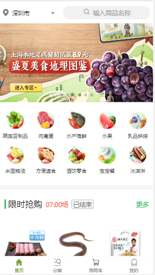

### About
此项目是一个专注优质生鲜的WebApp，所有的数据都是从服务器实时获取的真实数据。

### 说明
如果对您对此项目有兴趣，可以点 "Star" 支持一下 谢谢！ ^_^

如有问题请直接在 Issues 中提，或者您发现问题并有非常好的解决方案，欢迎 PR +1

传送门：<a href="https://github.com/HuangGang16/currencyServer">后端项目地址</a>

### 技术栈
vue2 + vuex + vue-router + webpack + ES6/7 + axios + vant + flex + svg 
 
### 项目运行
注意：由于涉及ES6/7 等新属性，node 需要 6.0 以上版本
git clone https://github.com/HuangGang16/currency_shop

cd currency_shop

npm install

npm run dev 
 
 
### 总结
1、vue因其轻量级的框架在中小型项目中表现亮眼，在大型单页面应用中因为vuex的存在，表现依然出色，在处理复杂交互逻辑的时候，vuex的存在是不可或缺的。所以说利用 vue + vuex 完全可以去做大型的单页面项目。

2、项目写到现在，从 登录注册到首页、购物车、下单、订单列表、个人中心 一个流程走完之后、不但对vue的理解更深一层，而且对以后掌控大型项目的时候也有非常多的帮助，做一个实际的项目才能对自己有很大的提升。
 
### 部分截图
首页

分类页

购物车

订单页

个人中心

登录
